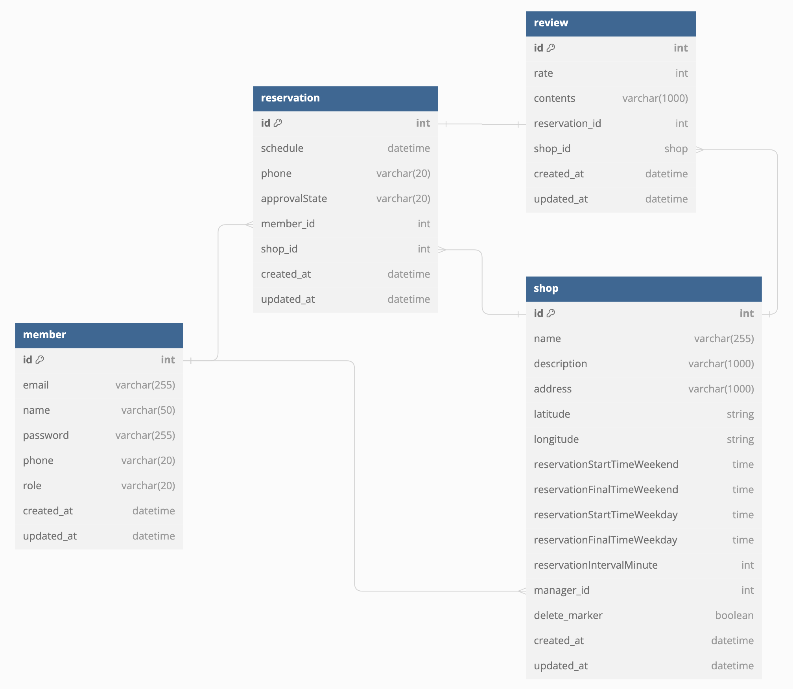

# 매장 테이블 예약 서비스

## 사용기술

- Spring Boot 3.2.5
- Java 21
- Spring Web
- Spring Security
- Spring Data JPA
- Spring Validation
- MariaDB 11.2.3
- Swagger
- mybatis
- jjwt
- lombok
- mockito

## Database ERD

- 

## API

```
localhost:8080/swagger-ui.html
```
- 회원가입, 로그인 후 오른쪽 상단의 Authorize 버튼을 눌러 토큰 입력해서 사용

## 기본 시나리오
- 회원가입 기능 구현 여부 (매장점장 및 사용자)
  - 회원가입
    - POST /member/signup
    - 회원가입시 partner: true를 넣어주면 Manager로 가입할 수 있고, 생략하거나 false를 넣어주면 Customer로 가입할 수 있음
  - 로그인
    - POST /member/login
    - 로그인 후 나오는 token값을 Swagger 화면 오른쪽 상단의 Authorize에 입력 후 사용
    - Customer와 Manager에 필요한 값이 있을 때 토큰을 바꿔줘야 함

- 매장 등록/수정/삭제 기능 구현 여부
  - 매장등록
    - POST /manager/shops
  - 매장수정
    - POST /manager/shops/{id}
  - 매장삭제
    - DELETE /manager/shops/{id}

- 예약진행(예약가능 여부 확인 후 예약 진행)
  - 예약 가능한 시간 보기
    - GET /customer/reservations/timetable
  - 에약하기
    - POST /customer/reservations

- 점주가 승인 후 체크인 하기
  - 점주가 예약 승인하기
    - POST /manager/reservations
  - 체크인하기
    - POST /manager/reservations/checkin
   
- 예약이용 후 리뷰작성 기능(예약자인지 확인 및 작성, 수정, 삭제)
  - 리뷰 작성
    - POST /customer/review
  - 리뷰 수정
    - POST /customer/reviews/{reviewId}
  - 리뷰 제거
    - DELETE /customer/reviews/{reviewId}
  - 작성, 수정은 해당 예약자만 가능
  - 삭제는 해당 예약자와 점주만 가능